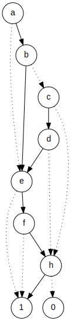

# ROBDD

**An ROBDD constructor and SAT/unSAT solver (WIP)** written in C++

## Requirement

`flex`, `bison` for ROBDD frontend, `graphviz` for image generating.

## Usage

`make ROBDD` conpile to binary first.

~~~~
Usage: ROBDD [-Ssc] [-o filename]
 -S         - Check if the proposition is All-SAT
 -s         - Check if the proposition is Any-SAT
 -c         - Return SAT count for the proposition
 -o file    - Print ROBDD to filename.svg
~~~~

Input your proposition then.

## Syntax

### Variable

For BDD, we take every variables as bool variables, which means they only take 0 or 1 as assignment.

Each variable must start with letter (uppercase or lowercase), and can be a mixture of digits of letter, as regex `[a-zA-Z]+[0-9]*` suggests.

### Operator

| Symbol | Corresponding operation | Example                        | Priority |
| ------ | ----------------------- | ------------------------------ | -------- |
| `~`    | $\neg$ not              | `~a` for $\neg a$              | 1        |
| `&`    | $\wedge$ and            | `a&b` for $a\wedge b$          | 2        |
| `\|`   | $\vee$ or               | `a|b` for $a\wedge b$          | 2        |
| `=`    | $\leftrightarrow$ xnor  | `a=b` for $a\leftrightarrow b$ | 2        |
| `!=`   | $\neq$ xor              | `a!=b` for $a\neq b$           | 2        |
| `->`   | $\rightarrow$ infer     | `a->b` for $a\rightarrow b$    | 3        |
| `()`   | pair of parentheses     | `(some formula here)`          | 0        |

Smaller number means higher priority.

A valid proposition for example: `Aa&B->C0|h`

## Credits

Henrik Reif Andersen, who wrote *[An Introduction to Binary Decision Diagrams](https://www.cs.utexas.edu/~isil/cs389L/bdd.pdf)* and it's my major reference.