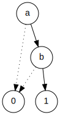

# ROBDD Constructor

**An ROBDD constructor and SAT/unSAT solver** written in C++, featured by **LALR** parsing

Implemented as class project, shared with love

## Requirement

`flex`, `bison` for ROBDD frontend, `graphviz` for image generating.

~~~~mermaid
flowchart LR
    subgraph Frontend
    Flex--"lexical symbol"-->Bison
    end
    subgraph Backend
    ROBDD
    end
    subgraph Visualization
    Graphviz
    end
    Bison<--"construct & reduce\nby LALR"-->ROBDD
    ROBDD--"format &\noutput"-->Graphviz
~~~~

## Usage

`make ROBDD` compile to binary first.

~~~~
Usage: ROBDD [-SscAa] [-o filename]
 -S           - Check if the proposition is All-SAT
 -s           - Check if the proposition is Any-SAT
 -A           - Construct ROBDD under fixed ASCII order,
                smallest variable at top
 -a (default) - Construct ROBDD under parsing order
 -c           - Return SAT count for the proposition
 -t           - Return ROBDD construction time cost
 -o filename  - Print ROBDD to filename.svg
~~~~

*Note: `-a` is a heuristic approach, `-A` may result in over-sized ROBDD*

Input your proposition then.

## Syntax

### Variable

For BDD, we take every variables as bool variables, which means they only take 0 or 1 as assignment. Each variable must start with letter (uppercase or lowercase), and can be a mixture of digits of letter, as regex `[a-zA-Z]+[0-9]*` suggests.

### Operator

| Symbol | Corresponding operation | Example                        | Priority |
| ------ | ----------------------- | ------------------------------ | -------- |
| `~`    | $\neg$ not              | `~a` for $\neg a$              | 1        |
| `&`    | $\wedge$ and            | `a&b` for $a\wedge b$          | 2        |
| `\|`   | $\vee$ or               | `a\|b` for $a\wedge b$         | 2        |
| `=`    | $\leftrightarrow$ xnor  | `a=b` for $a\leftrightarrow b$ | 2        |
| `!=`   | $\neq$ xor              | `a!=b` for $a\neq b$           | 2        |
| `->`   | $\rightarrow$ infer     | `a->b` for $a\rightarrow b$    | 3        |
| `()`   | pair of parentheses     | `(some formula here)`          | 0        |

Smaller number means higher priority.

A valid proposition for example: `Aa&B->C0|h`

## N Queens

There is a script  `n_queens_test/nqueens.py`, you can use its output as `ROBDD`'s input to test its correctness:

~~~~bash
python n_queens_test/nqueens.py 6 | ./ROBDD -Ssc
~~~~

Or print the output, an example is as below, for n > 6, visualization will take a long time.

__6 queens__

## Todo

- Short Term

​	Move print module to visitor pattern, uncouple ROBDD from extensions

- Long Term

​	Use Bison C++ APIs, introduce `std::shared_ptr` for auto pruning

## Credits

Henrik Reif Andersen, who wrote *[An Introduction to Binary Decision Diagrams](https://www.cs.utexas.edu/~isil/cs389L/bdd.pdf)* and it's my major reference.
